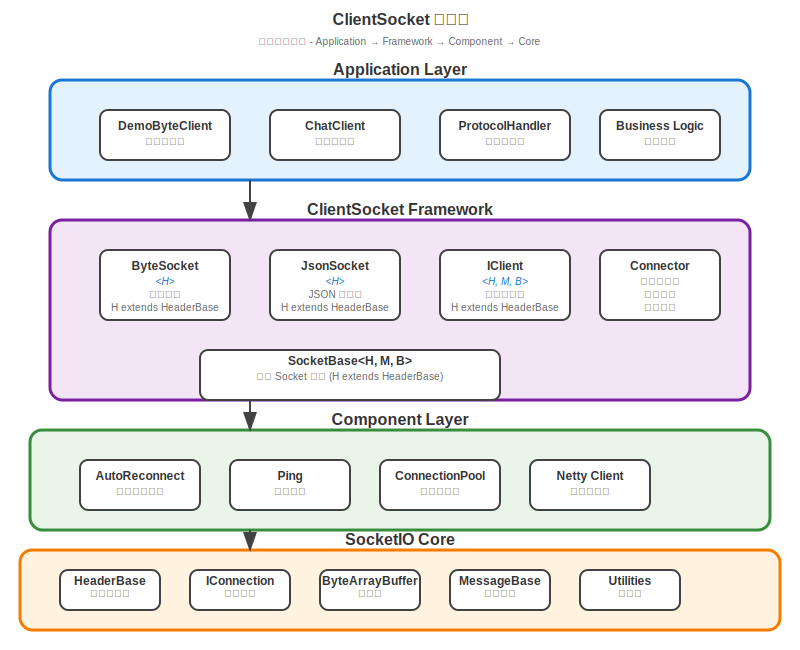

# ClientSocket 客戶端Socket模組

ClientSocket 是 TinySocket 專案的客戶端 Socket 實現模組，基於 socketio 核心庫構建的高性能、智能重連的 Socket 客戶端框架。它提供完整的泛型設計架構，支援自動重連、心跳保持、協議處理等功能，為各種客戶端應用提供穩定可靠的 Socket 連接解決方案。

## 📋 模組概述

ClientSocket 模組實現了 TinySocket 框架的客戶端核心功能，包括：

- **🔗 智能連接管理**: 自動重連、心跳保持、連接狀態監控
- **🔧 泛型設計架構**: 完整的泛型約束確保類型安全
- **📨 多協議支援**: ByteSocket（二進制）和 JsonSocket（JSON，含WebSocket支援）
- **⚡ 協議處理系統**: 協議註冊、異步處理、異常捕獲
- **🛠️ 開發友好**: 簡潔的 API 設計和豐富的回調接口
- **🌐 跨平台支援**: 支援各種客戶端環境（Android、桌面應用、Web 後端）
- **💬 聊天客戶端**: 完整的聊天應用客戶端實現示例

### 🎯 設計理念

- **高可用性**: 智能重連機制確保連接穩定性
- **類型安全**: 完整的泛型設計和編譯期檢查
- **易於使用**: 簡潔的 API 和豐富的配置選項
- **異步處理**: 基於 Netty 的異步 I/O 模型
- **擴展性**: 支援自定義協議和處理邏輯

## 🏗️ 架構設計

### 核心組件架構



**架構層次圖說明**: 上圖展示了 ClientSocket 的分層架構設計，從應用層到核心層的完整技術棧。

### 詳細組件結構

```
clientsocket/
├── src/main/java/com/vscodelife/clientsocket/
│   ├── SocketBase.java                # Socket 客戶端基類（泛型設計）
│   │   ├── 泛型約束: <H, M, B>
│   │   ├── 連接管理: Connector
│   │   ├── 訊息處理: messageQueue
│   │   ├── 協議註冊: protocolRegister
│   │   └── ID 生成: SnowflakeGenerator
│   ├── ByteSocket.java                # 二進制 Socket 客戶端（抽象類）
│   │   ├── 繼承: SocketBase<H, ByteMessage<H>, ByteArrayBuffer>
│   │   ├── 泛型約束: <H extends HeaderBase>
│   │   ├── 自動重連: autoReconnect 機制
│   │   ├── 心跳機制: Ping 保活機制
│   │   └── 調度器: scheduledThread
│   ├── JsonSocket.java                # JSON Socket 客戶端（抽象類）
│   │   ├── 繼承: SocketBase<H, JsonMessage<H>, JsonMapBuffer>
│   │   ├── 泛型約束: <H extends HeaderBase>
│   │   ├── 自動重連: autoReconnect 機制
│   │   ├── 心跳機制: Ping 保活機制
│   │   └── 調度器: scheduledThread
│   ├── IClient.java                   # 客戶端接口定義
│   │   ├── 連接管理: connect/disconnect
│   │   ├── 訊息發送: send 方法族
│   │   ├── 協議註冊: registerProtocol
│   │   └── 生命周期: 回調接口
│   ├── Connector.java                 # 連接器實現
│   │   ├── 連接管理: Bootstrap 配置
│   │   ├── 重連邏輯: 指數退避算法
│   │   ├── 心跳機制: 定時心跳檢測
│   │   └── 狀態監控: 連接狀態追蹤
│   └── component/                     # 組件系統
│       ├── ProtocolCatcher.java       # 協議異常捕獲器
│       │   ├── 異常處理包裝
│       │   ├── 錯誤日誌記錄
│       │   └── 優雅降級處理
│       └── ProtocolRegister.java      # 協議註冊器
│           ├── 協議處理器映射
│           ├── 類型安全處理
│           └── 消費者函數管理
```

### 架構層次說明

ClientSocket 採用分層架構設計，從上到下分為四個層次：

1. **Application Layer（應用層）**
   - 用戶自定義的 Socket 客戶端實現
   - 繼承 ByteSocket 或 JsonSocket 進行業務開發
   - 如遊戲客戶端、聊天客戶端等

2. **ClientSocket Framework（框架層）**
   - ByteSocket: 二進制數據傳輸客戶端
   - JsonSocket: JSON 數據傳輸客戶端
   - IClient: 統一的客戶端接口定義
   - Connector: 連接管理和重連邏輯
   - SocketBase: 泛型基類，提供完整的類型約束

3. **Component Layer（組件層）**
   - ProtocolCatcher: 協議異常捕獲和處理
   - AutoReconnect: 智能重連機制
   - Ping: 心跳保持機制

4. **SocketIO Core（核心層）**
   - 基於 Netty 的高性能網絡通信
   - ByteArrayBuffer, HeaderBase, MessageBase 等核心類
   - SnowflakeUtil, ProfilerUtil 等工具類

### 泛型設計架構

ClientSocket 採用簡化而強大的泛型設計：

```java
public abstract class SocketBase<H extends HeaderBase, 
                                M extends MessageBase<H, B>, 
                                B> implements IClient<H, M, B>
```

**泛型參數說明**：
- `H`: Header 類型，必須繼承 `HeaderBase`
- `M`: Message 類型，必須繼承 `MessageBase<H, B>`
- `B`: Buffer 類型，用於數據傳輸（如 `ByteArrayBuffer` 或 `JsonMapBuffer`）

## 🚀 核心功能

### 1. SocketBase 泛型基類設計

SocketBase 是所有 Socket 客戶端的基類，提供完整的泛型約束：

```java
public class GameClient extends ByteSocket<GameHeader> {
    private static final Logger logger = LoggerFactory.getLogger(GameClient.class);
    
    private String username;
    private String token;
    private boolean authenticated = false;
    
    public GameClient(String username, String password) {
        super(logger, GameInitializer.class);
        
        this.username = username;
        
        // 配置自動重連
        setAutoReconnect(true);
        setMaxReconnectAttempts(10);
        setReconnectInterval(5); // 5秒重連間隔
        
        // 配置心跳
        setPingInterval(30); // 30秒心跳間隔
        setPingTimeout(10);  // 10秒心跳超時
        
        // 註冊協議處理器
        registerProtocol(GameProtocol.LOGIN_RESULT, catchException(this::handleLoginResult));
        registerProtocol(GameProtocol.GAME_EVENT, catchException(this::handleGameEvent));
        registerProtocol(GameProtocol.CHAT_MESSAGE, catchException(this::handleChatMessage));
    }
    
    @Override
    public String getVersion() {
        return "1.0.0";
    }
    
    @Override
    public Class<GameClient> getSocketClazz() {
        return GameClient.class;
    }
    
    @Override
    public void onConnected(long connectorId, ChannelHandlerContext ctx) {
        super.onConnected(connectorId, ctx);
        logger.info("已連接到遊戲服務器");
        
        // 自動發送登入請求
        sendLoginRequest();
    }
    
    @Override
    public void onDisconnected(long connectorId, ChannelHandlerContext ctx) {
        super.onDisconnected(connectorId, ctx);
        logger.info("與遊戲服務器斷開連接");
        
        // 重置認證狀態
        authenticated = false;
        token = null;
    }
    
    @Override
    public void onReconnected(long connectorId, ChannelHandlerContext ctx) {
        super.onReconnected(connectorId, ctx);
        logger.info("已重新連接到遊戲服務器");
        
        // 重新認證
        if (token != null) {
            sendTokenRefresh();
        } else {
            sendLoginRequest();
        }
    }
    
    @Override
    public void onException(long connectorId, ChannelHandlerContext ctx, Throwable cause) {
        super.onException(connectorId, ctx, cause);
        logger.error("客戶端發生異常", cause);
    }
    
    // 自定義訊息打包
    @Override
    protected ByteMessage<GameHeader> pack(String version, int mainNo, int subNo, 
                                          long sessionId, long requestId, ByteArrayBuffer buffer) {
        // 檢查是否需要壓縮
        boolean isCompress = buffer.readableBytes() > 3000;
        if (isCompress) {
            buffer.compress();
        }
        
        // 創建自定義 Header
        GameHeader header = new GameHeader(version, mainNo, subNo, isCompress,
                                          sessionId, requestId, username, token, getClientInfo());
        return new ByteMessage<>(header, buffer);
    }
    
    private void sendLoginRequest() {
        ByteArrayBuffer request = new ByteArrayBuffer();
        request.writeString(username);
        request.writeString(getPasswordHash());
        request.writeString(getDeviceId());
        
        send(GameProtocol.LOGIN, request);
    }
    
    private void handleLoginResult(ByteMessage<GameHeader> message) {
        int result = message.getBuffer().readInt();
        if (result == 1) { // 登入成功
            this.token = message.getBuffer().readString();
            this.authenticated = true;
            logger.info("登入成功，獲得 token: {}", token);
            
            // 觸發登入成功事件
            onLoginSuccess(token);
        } else {
            String errorMsg = message.getBuffer().readString();
            logger.error("登入失敗: {}", errorMsg);
            
            // 觸發登入失敗事件
            onLoginFailed(errorMsg);
        }
    }
    
    private void handleGameEvent(ByteMessage<GameHeader> message) {
        int eventType = message.getBuffer().readInt();
        String eventData = message.getBuffer().readString();
        
        logger.info("收到遊戲事件: type={}, data={}", eventType, eventData);
        
        // 處理不同類型的遊戲事件
        switch (eventType) {
            case 1: // 玩家加入
                onPlayerJoined(eventData);
                break;
            case 2: // 玩家離開
                onPlayerLeft(eventData);
                break;
            case 3: // 遊戲狀態更新
                onGameStateUpdate(eventData);
                break;
        }
    }
    
    private void handleChatMessage(ByteMessage<GameHeader> message) {
        String sender = message.getBuffer().readString();
        String content = message.getBuffer().readString();
        long timestamp = message.getBuffer().readLong();
        
        onChatMessage(sender, content, new Date(timestamp));
    }
    
    // 業務回調接口
    protected void onLoginSuccess(String token) {
        // 子類可重寫實現具體邏輯
    }
    
    protected void onLoginFailed(String error) {
        // 子類可重寫實現具體邏輯
    }
    
    protected void onPlayerJoined(String playerInfo) {
        // 子類可重寫實現具體邏輯
    }
    
    protected void onPlayerLeft(String playerInfo) {
        // 子類可重寫實現具體邏輯
    }
    
    protected void onGameStateUpdate(String gameState) {
        // 子類可重寫實現具體邏輯
    }
    
    protected void onChatMessage(String sender, String content, Date timestamp) {
        // 子類可重寫實現具體邏輯
    }
    
    // 公共 API
    public boolean isAuthenticated() {
        return authenticated;
    }
    
    public void sendChatMessage(String message) {
        if (authenticated) {
            ByteArrayBuffer buffer = new ByteArrayBuffer();
            buffer.writeString(message);
            send(GameProtocol.SEND_CHAT, buffer);
        }
    }
    
    public void joinGame(int gameId) {
        if (authenticated) {
            ByteArrayBuffer buffer = new ByteArrayBuffer();
            buffer.writeInt(gameId);
            send(GameProtocol.JOIN_GAME, buffer);
        }
    }
}
```

### 2. ByteSocket 二進制客戶端

ByteSocket 專為高性能二進制數據傳輸設計：

```java
// 繼承 ByteSocket 實現聊天客戶端
public class ChatClient extends ByteSocket<ChatHeader> {
    private final AtomicBoolean connected = new AtomicBoolean(false);
    private final AtomicBoolean authenticated = new AtomicBoolean(false);
    private String currentRoom;
    
    public ChatClient(String userId, String password) {
        super(LoggerFactory.getLogger(ChatClient.class), ChatInitializer.class);
        
        // 配置重連策略
        setAutoReconnect(true);
        setMaxReconnectAttempts(5);
        setReconnectInterval(3);
        
        // 註冊協議處理器
        registerProtocol(ChatProtocol.AUTH_RESULT, catchException(this::handleAuthResult));
        registerProtocol(ChatProtocol.ROOM_LIST, catchException(this::handleRoomList));
        registerProtocol(ChatProtocol.JOIN_ROOM_RESULT, catchException(this::handleJoinRoomResult));
        registerProtocol(ChatProtocol.CHAT_MESSAGE, catchException(this::handleChatMessage));
        registerProtocol(ChatProtocol.USER_ONLINE, catchException(this::handleUserOnline));
        registerProtocol(ChatProtocol.USER_OFFLINE, catchException(this::handleUserOffline));
    }
    
    @Override
    public void onConnected(long connectorId, ChannelHandlerContext ctx) {
        super.onConnected(connectorId, ctx);
        connected.set(true);
        
        // 自動發送認證請求
        authenticateUser();
    }
    
    @Override
    public void onDisconnected(long connectorId, ChannelHandlerContext ctx) {
        super.onDisconnected(connectorId, ctx);
        connected.set(false);
        authenticated.set(false);
        currentRoom = null;
    }
    
    private void authenticateUser() {
        ByteArrayBuffer auth = new ByteArrayBuffer();
        auth.writeString(userId);
        auth.writeString(encryptPassword(password));
        send(ChatProtocol.AUTHENTICATE, auth);
    }
    
    private void handleAuthResult(ByteMessage<ChatHeader> message) {
        boolean success = message.getBuffer().readBoolean();
        if (success) {
            authenticated.set(true);
            String token = message.getBuffer().readString();
            logger.info("認證成功，token: {}", token);
            
            // 請求房間列表
            requestRoomList();
        } else {
            String error = message.getBuffer().readString();
            logger.error("認證失敗: {}", error);
        }
    }
    
    public void requestRoomList() {
        if (authenticated.get()) {
            send(ChatProtocol.GET_ROOM_LIST, new ByteArrayBuffer());
        }
    }
    
    public void joinRoom(String roomId) {
        if (authenticated.get()) {
            ByteArrayBuffer request = new ByteArrayBuffer();
            request.writeString(roomId);
            send(ChatProtocol.JOIN_ROOM, request);
        }
    }
    
    public void sendMessage(String message) {
        if (authenticated.get() && currentRoom != null) {
            ByteArrayBuffer msg = new ByteArrayBuffer();
            msg.writeString(message);
            send(ChatProtocol.SEND_MESSAGE, msg);
        }
    }
}
```

### 3. JsonSocket JSON 客戶端

JsonSocket 提供便於調試和跨語言通信的 JSON 協議支援，特別適用於Web應用和聊天系統：

```java
// API客戶端示例
public class ApiClient extends JsonSocket<ApiHeader> {
    private String apiKey;
    private CompletableFuture<JsonMapBuffer> pendingRequest;
    
    public ApiClient(String apiKey) {
        super(LoggerFactory.getLogger(ApiClient.class), ApiInitializer.class);
        this.apiKey = apiKey;
        
        // 配置連接參數
        setAutoReconnect(false); // API 客戶端通常不需要自動重連
        setConnectTimeout(10000); // 10秒連接超時
        
        // 註冊 API 回應處理器
        registerProtocol(ApiProtocol.API_RESPONSE, catchException(this::handleApiResponse));
        registerProtocol(ApiProtocol.API_ERROR, catchException(this::handleApiError));
    }
    
    public CompletableFuture<JsonMapBuffer> callApi(String endpoint, JsonMapBuffer params) {
        if (!isConnected()) {
            return CompletableFuture.failedFuture(new IllegalStateException("未連接"));
        }
        
        JsonMapBuffer request = new JsonMapBuffer();
        request.put("endpoint", endpoint);
        request.put("params", params);
        request.put("apiKey", apiKey);
        request.put("timestamp", System.currentTimeMillis());
        
        pendingRequest = new CompletableFuture<>();
        send(ApiProtocol.API_REQUEST, request);
        
        return pendingRequest;
    }
    
    private void handleApiResponse(JsonMessage<ApiHeader> message) {
        JsonMapBuffer response = message.getBuffer();
        if (pendingRequest != null) {
            pendingRequest.complete(response);
            pendingRequest = null;
        }
    }
    
    private void handleApiError(JsonMessage<ApiHeader> message) {
        JsonMapBuffer error = message.getBuffer();
        if (pendingRequest != null) {
            String errorMsg = error.getString("message");
            pendingRequest.completeExceptionally(new RuntimeException(errorMsg));
            pendingRequest = null;
        }
    }
    
    // 便捷的 API 調用方法
    public CompletableFuture<JsonMapBuffer> getUserInfo(String userId) {
        JsonMapBuffer params = new JsonMapBuffer();
        params.put("userId", userId);
        return callApi("/user/info", params);
    }
    
    public CompletableFuture<JsonMapBuffer> updateUserProfile(String userId, JsonMapBuffer profile) {
        JsonMapBuffer params = new JsonMapBuffer();
        params.put("userId", userId);
        params.put("profile", profile);
        return callApi("/user/update", params);
    }
}

// 聊天客戶端示例（與demo中的聊天服務器配合使用）
public class ChatJsonClient extends JsonSocket<ChatUserHeader> {
    private String userId;
    private String token;
    private boolean authenticated = false;
    
    public ChatJsonClient(String userId) {
        super(LoggerFactory.getLogger(ChatJsonClient.class), ChatClientInitializer.class);
        this.userId = userId;
        
        // 配置自動重連
        setAutoReconnect(true);
        setReconnectInterval(5); // 5秒重連間隔
        setMaxReconnectAttempts(10);
        
        // 註冊協議處理器
        registerProtocol(1, 1, this::handleLoginResponse);    // 登入回應
        registerProtocol(2, 2, this::handleChatMessage);      // 接收聊天訊息
        registerProtocol(2, 3, this::handleChatHistory);      // 聊天記錄
        registerProtocol(3, 1, this::handleUserListUpdate);   // 用戶列表更新
        registerProtocol(4, 2, this::handleSystemNotification); // 系統通知
    }
    
    // 登入聊天室
    public void login(String password) {
        if (!isConnected()) {
            throw new IllegalStateException("未連接到服務器");
        }
        
        JsonMapBuffer request = new JsonMapBuffer();
        request.put("userId", userId);
        request.put("password", password);
        
        send(1, 1, request); // mainNo=1, subNo=1 登入協議
    }
    
    // 發送聊天訊息
    public void sendMessage(String content) {
        if (!authenticated) {
            throw new IllegalStateException("未登入");
        }
        
        JsonMapBuffer request = new JsonMapBuffer();
        request.put("content", content);
        
        send(2, 1, request); // mainNo=2, subNo=1 發送訊息協議
    }
    
    // 獲取用戶列表
    public void requestUserList() {
        if (!authenticated) {
            return;
        }
        
        send(4, 1, new JsonMapBuffer()); // mainNo=4, subNo=1 獲取用戶列表
    }
    
    // 處理登入回應
    private void handleLoginResponse(JsonMessage<ChatUserHeader> message) {
        JsonMapBuffer buffer = message.getBuffer();
        int code = buffer.getInteger("code");
        
        if (code == 1) {
            // 登入成功
            this.token = buffer.getString("token");
            this.authenticated = true;
            
            JsonMapBuffer user = buffer.getJsonMapBuffer("user");
            onLoginSuccess(token, user);
            
            logger.info("登入成功: userId={}", userId);
        } else {
            // 登入失敗
            String errorMsg = buffer.getString("message");
            onLoginFailed(errorMsg);
            
            logger.error("登入失敗: {}", errorMsg);
        }
    }
    
    // 處理聊天訊息
    private void handleChatMessage(JsonMessage<ChatUserHeader> message) {
        JsonMapBuffer buffer = message.getBuffer();
        
        String senderId = buffer.getString("userId");
        String senderName = buffer.getString("userName");
        String content = buffer.getString("content");
        long timestamp = buffer.getLong("timestamp");
        String messageType = buffer.getString("messageType");
        
        onChatMessage(senderId, senderName, content, new Date(timestamp), messageType);
    }
    
    // 處理聊天記錄
    private void handleChatHistory(JsonMessage<ChatUserHeader> message) {
        JsonMapBuffer buffer = message.getBuffer();
        List<JsonMapBuffer> messages = buffer.getJsonMapBufferList("messages");
        
        onChatHistory(messages);
    }
    
    // 處理用戶列表更新
    private void handleUserListUpdate(JsonMessage<ChatUserHeader> message) {
        JsonMapBuffer buffer = message.getBuffer();
        List<JsonMapBuffer> users = buffer.getJsonMapBufferList("users");
        
        onUserListUpdate(users);
    }
    
    // 處理系統通知
    private void handleSystemNotification(JsonMessage<ChatUserHeader> message) {
        JsonMapBuffer buffer = message.getBuffer();
        String notificationMsg = buffer.getString("content");
        long timestamp = buffer.getLong("timestamp");
        
        onSystemNotification(notificationMsg, new Date(timestamp));
    }
    
    // 回調方法（子類可重寫）
    protected void onLoginSuccess(String token, JsonMapBuffer user) {
        // 登入成功處理
    }
    
    protected void onLoginFailed(String errorMessage) {
        // 登入失敗處理
    }
    
    protected void onChatMessage(String senderId, String senderName, String content, Date timestamp, String messageType) {
        // 聊天訊息處理
    }
    
    protected void onChatHistory(List<JsonMapBuffer> messages) {
        // 聊天記錄處理
    }
    
    protected void onUserListUpdate(List<JsonMapBuffer> users) {
        // 用戶列表更新處理
    }
    
    protected void onSystemNotification(String message, Date timestamp) {
        // 系統通知處理
    }
    
    @Override
    public void onConnected(long connectorId) {
        super.onConnected(connectorId);
        logger.info("連接到聊天服務器成功");
    }
    
    @Override
    public void onDisconnected(long connectorId, ChannelHandlerContext ctx) {
        super.onDisconnected(connectorId, ctx);
        this.authenticated = false;
        logger.info("與聊天服務器斷開連接");
    }
}
```

### 4. 自動重連機制

```java
public class AutoReconnectExample {
    
    public void configureReconnection(ByteSocket<?> client) {
        // 啟用自動重連
        client.setAutoReconnect(true);
        
        // 設置重連參數
        client.setMaxReconnectAttempts(10);    // 最大重連次數
        client.setReconnectInterval(5);        // 重連間隔（秒）
        client.setReconnectBackoffMultiplier(1.5); // 退避倍數
        client.setMaxReconnectInterval(60);    // 最大重連間隔（秒）
        
        // 重連事件監聽
        client.setReconnectListener(new ReconnectListener() {
            @Override
            public void onReconnectAttempt(int attemptCount, int maxAttempts) {
                logger.info("嘗試重連: {}/{}", attemptCount, maxAttempts);
            }
            
            @Override
            public void onReconnectSuccess(int totalAttempts) {
                logger.info("重連成功，總嘗試次數: {}", totalAttempts);
            }
            
            @Override
            public void onReconnectFailed(int totalAttempts) {
                logger.error("重連失敗，已達到最大嘗試次數: {}", totalAttempts);
            }
        });
    }
}
```

### 5. 心跳保持機制

```java
public class HeartbeatExample {
    
    public void configureHeartbeat(ByteSocket<?> client) {
        // 啟用心跳
        client.setPingEnabled(true);
        
        // 設置心跳參數
        client.setPingInterval(30);        // 心跳間隔（秒）
        client.setPingTimeout(10);         // 心跳超時（秒）
        client.setMaxMissedPings(3);       // 最大丟失心跳數
        
        // 心跳事件監聽
        client.setPingListener(new PingListener() {
            @Override
            public void onPingSent(long timestamp) {
                logger.debug("發送心跳: {}", timestamp);
            }
            
            @Override
            public void onPongReceived(long rtt) {
                logger.debug("收到心跳回應，RTT: {}ms", rtt);
            }
            
            @Override
            public void onPingTimeout() {
                logger.warn("心跳超時");
            }
            
            @Override
            public void onHeartbeatFailed(int missedCount) {
                logger.error("心跳失敗，丟失次數: {}", missedCount);
            }
        });
    }
}
```

### 6. 協議處理器註冊

```java
public class ProtocolRegistrationExample {
    
    public void registerProtocols(MyClient client) {
        // 基本協議註冊
        client.registerProtocol(1001, this::handleLogin);
        client.registerProtocol(1002, this::handleLogout);
        
        // 帶異常處理的協議註冊
        client.registerProtocol(2001, client.catchException(this::handleGameData));
        client.registerProtocol(2002, client.catchException(this::handleChatMessage));
        
        // Lambda 表達式註冊
        client.registerProtocol(3001, message -> {
            int status = message.getBuffer().readInt();
            logger.info("收到狀態更新: {}", status);
        });
        
        // 方法引用註冊
        client.registerProtocol(4001, this::handleNotification);
    }
    
    private void handleLogin(ByteMessage<MyHeader> message) {
        // 處理登入回應
    }
    
    private void handleGameData(ByteMessage<MyHeader> message) {
        // 處理遊戲數據（可能拋出異常）
        String data = message.getBuffer().readString();
        if (data == null) {
            throw new IllegalArgumentException("遊戲數據不能為空");
        }
        
        // 處理邏輯...
    }
    
    private void handleNotification(ByteMessage<MyHeader> message) {
        // 處理通知訊息
    }
}
```

## 📈 性能特性

- **連接復用**: 長連接減少建立開銷
- **智能重連**: 指數退避算法避免雪崩
- **心跳優化**: 最小化網絡流量
- **訊息快取**: 重用訊息對象減少 GC
- **壓縮傳輸**: 自動壓縮大訊息節省帶寬

## 🔮 發展計劃

### 已完成功能 ✅
- [x] **SocketBase 泛型基類**: 完整的泛型約束設計
- [x] **ByteSocket/JsonSocket**: 二進制和 JSON 協議支援
- [x] **自動重連機制**: 智能重連和指數退避
- [x] **心跳保持機制**: 連接活躍檢測和自動恢復
- [x] **協議處理系統**: 協議註冊和異常處理
- [x] **Connector 連接管理**: 統一的連接生命周期管理

---

**由 vscodelife 團隊精心打造** ❤️  
*讓 Socket 客戶端開發變得簡單而可靠*

> **版本**: v0.0.1-SNAPSHOT  
> **最後更新**: 2025年9月13日  
> **Java版本**: OpenJDK 21+  
> **技術棧**: Netty 4.1.115 + SocketIO Core
> **新增功能**: JsonSocket聊天客戶端 + WebSocket支援

[](https://github.com/vscodelife/tinysocket)
[](https://github.com/vscodelife/tinysocket)
[](https://github.com/vscodelife/tinysocket/issues)
[](../LICENSE)
