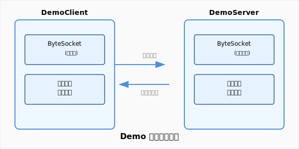

# Demo 示範應用模組

Demo 是 TinySocket 專案的完整示範應用模組，展示如何使用 socketio、serversocket 和 clientsocket 模組構建完整的 Socket 應用程式。它包含服務器端和客戶端的完整實現示例，提供二進制通信協議的演示，是學習和理解 TinySocket 框架的最佳起點。

## 📋 模組概述

Demo 模組提供了 TinySocket 框架的完整使用示例，包含：

- **🚀 服務器端示例**: 基於 ByteSocket 的高性能服務器實現
- **🔗 客戶端示例**: 包含自動重連、心跳保持的客戶端實現  
- **📨 協議演示**: 展示認證、通信等常見協議處理，使用 @ProtocolTag 註解驅動
- **🌐 Spring Boot 整合**: 完整的 Spring Boot 應用配置和啟動流程
- **💬 聊天系統**: 基於JsonSocket的完整聊天應用實現
- **🖥️ Web界面**: 現代化的聊天室前端界面（HTML/CSS/JS）
- **🧪 測試用例**: 包含單元測試和整合測試範例
- **📈 性能監控**: 內建性能分析和監控示例

### 🎯 示例場景

Demo 模組模擬了兩種完整的通信系統：

#### 1. **二進制通信系統**（ByteSocket示例）
- **用戶認證**: 登入/登出機制，JWT Token 管理
- **實時通信**: 即時訊息傳遞和廣播
- **連接管理**: 自動重連、心跳保持、異常處理
- **性能監控**: 連接統計、訊息統計、性能分析

#### 2. **Web聊天系統**（JsonSocket示例）
- **現代化界面**: 響應式Web聊天室設計
- **實時聊天**: 基於WebSocket的即時通訊
- **用戶管理**: 在線用戶列表、上線/下線通知
- **聊天記錄**: 維護最近50條聊天記錄
- **系統通知**: 自動系統消息推送

## 🏗️ 專案結構

```
demo/
├── src/
│   ├── main/
│   │   ├── java/com/vscodelife/demo/
│   │   │   ├── DemoByteServer.java          # 二進制服務器啟動類
│   │   │   ├── DemoByteClient.java          # 客戶端啟動類
│   │   │   ├── DemoChatServer.java          # 聊天服務器啟動類
│   │   │   ├── constant/                    # 協議常量定義
│   │   │   │   └── ProtocolId.java              # 協議ID常量
│   │   │   ├── entity/                      # 實體類
│   │   │   │   ├── User.java                    # 用戶實體類
│   │   │   │   └── ChatMessage.java             # 聊天訊息實體
│   │   │   ├── server/                      # 服務器端實現（二進制）
│   │   │   │   ├── TestByteServer.java          # 測試服務器
│   │   │   │   ├── ByteUserHeader.java          # 自定義 Header
│   │   │   │   ├── ByteUserConnection.java      # 自定義 Connection
│   │   │   │   ├── ByteInitializer.java         # Netty 初始化器
│   │   │   │   ├── ByteProtocol.java            # 協議處理器（註解驅動）
│   │   │   │   ├── component/                   # 服務器組件
│   │   │   │   │   ├── UserManager.java             # 用戶管理器
│   │   │   │   │   └── ChatManager.java             # 聊天管理器
│   │   │   │   ├── exception/                   # 異常處理
│   │   │   │   └── handler/                     # 服務器處理器
│   │   │   │       └── ByteMessageHandler.java      # 訊息處理器
│   │   │   ├── webserver/                   # Web服務器端實現（JSON）
│   │   │   │   ├── ChatWebServer.java           # JSON聊天服務器
│   │   │   │   ├── ChatUserHeader.java          # 聊天用戶Header
│   │   │   │   ├── ChatUserConnection.java      # 聊天用戶連接
│   │   │   │   ├── ChatInitializer.java         # 聊天初始化器
│   │   │   │   ├── ChatProtocol.java            # 聊天協議處理器
│   │   │   │   ├── component/                   # Web服務器組件
│   │   │   │   │   ├── ChatManager.java             # 聊天管理器
│   │   │   │   │   └── UserManager.java             # 用戶管理器
│   │   │   │   ├── handler/                     # Web處理器
│   │   │   │   └── util/                        # Web工具類
│   │   │   └── client/                      # 客戶端實現
│   │   │       ├── TestByteClient.java          # 測試客戶端
│   │   │       ├── ByteUserHeader.java          # 客戶端 Header
│   │   │       ├── ByteInitializer.java         # 客戶端初始化器
│   │   │       ├── ByteProtocol.java            # 客戶端協議處理
│   │   │       ├── component/                   # 客戶端組件
│   │   │       │   └── CommandManager.java          # 命令管理器
│   │   │       └── handler/                     # 客戶端處理器
│   │   │           ├── ByteConnectHandler.java      # 連接處理器
│   │   │           ├── ByteMessageHandler.java      # 訊息處理器
│   │   │           ├── ByteHeaderDecoderHandler.java # Header解碼器
│   │   │           └── ByteHeaderEncoderHandler.java # Header編碼器
│   │   └── resources/
│   │       └── application.yml              # Spring Boot 配置
├── chatjs/                                  # Web聊天室前端
│   ├── index.html                           # 聊天室首頁
│   ├── chat-client.js                       # 聊天客戶端邏輯
│   ├── app.js                               # 應用主邏輯
│   └── styles.css                           # 樣式表
│   └── test/
│       └── java/com/vscodelife/demo/test/
│           └── Test.java                    # 測試類
└── pom.xml                                  # Maven 配置
```

### 架構設計

Demo 模組採用經典的客戶端-服務器架構：



## 🚀 打包方式

Demo 模組支持多種打包方式，可以根據不同的使用場景選擇對應的打包配置。每種打包方式都會生成一個包含所有依賴的可執行 ZIP 檔案。

### 📦 打包配置

Demo 模組提供了4種預設的打包配置：

| 配置 | 描述 | 主類 | 用途 |
|-----|------|------|------|
| `all` | 完整打包（默認） | 包含所有組件 | 開發和測試環境 |
| `byte-server` | 二進制服務器打包 | DemoByteServer | 生產環境服務器部署 |
| `byte-client` | 二進制客戶端打包 | DemoByteClient | 客戶端應用部署 |
| `web-chat` | Web聊天服務器打包 | DemoChatServer | Web聊天服務部署 |

### ⚙️ 打包指令

#### 1. **預設打包（all 配置）**
```bash
# 編譯並打包所有組件
mvn clean package

# 或者明確指定 all profile
mvn clean package -Pall
```

#### 2. **服務器端打包**
```bash
# 打包二進制服務器
mvn clean package -Pbyte-server

# 打包Web聊天服務器  
mvn clean package -Pweb-chat
```

#### 3. **客戶端打包**
```bash
# 打包二進制客戶端
mvn clean package -Pbyte-client
```

### 📁 打包輸出結構

打包完成後，在 `target/` 目錄下會生成對應的 ZIP 檔案：

```
target/
├── demo-0.0.1-SNAPSHOT.zip          # all 配置打包結果
├── byte-server-0.0.1-SNAPSHOT.zip   # byte-server 配置打包結果  
├── byte-client-0.0.1-SNAPSHOT.zip   # byte-client 配置打包結果
└── web-chat-0.0.1-SNAPSHOT.zip      # web-chat 配置打包結果
```

解壓 ZIP 檔案後的目錄結構：

```
demo-0.0.1-SNAPSHOT/
├── lib/                              # 所有 JAR 依賴檔案
│   ├── demo-0.0.1-SNAPSHOT.jar       # 主應用 JAR
│   ├── spring-boot-*.jar             # Spring Boot 依賴
│   ├── socketio-*.jar                # TinySocket 依賴
│   └── ...                           # 其他依賴
├── config/                           # 配置檔案（如果有）
│   └── application.yml
├── log/                              # 日誌目錄（運行時創建）
└── run.bat                           # Windows 啟動腳本
```

## ⚡ 快速開始

### 方式一：傳統 ByteSocket 演示


**🎬 演示說明**：上面的截圖展示了 TinySocket ByteSocket 二進制通信系統的完整功能，包括：
- 🔐 **用戶認證**: 基於用戶名密碼的登入驗證機制
- 🚀 **自動連接**: 客戶端自動連接服務器並維持連接狀態
- 💬 **即時通信**: 支援雙向即時訊息傳遞和廣播
- 🔄 **心跳保持**: 自動心跳檢測，確保連接穩定性
- 📊 **連接監控**: 實時顯示連接狀態和統計資訊
- 🛠️ **異常處理**: 完善的異常捕獲和重連機制

#### 1. 啟動服務器

```bash
.\run-byte-server.bat
```

服務器啟動後會監聽指定端口（默認 30001），並輸出以下信息：

```
2025-09-01 10:00:00.123 INFO  - 註冊協議數量: 4
2025-09-01 10:00:00.456 INFO  - 服務器啟動成功，監聽端口: 30001
2025-09-01 10:00:00.789 INFO  - 最大連接數: 1000
```

#### 2. 啟動客戶端

```bash
.\run-byte-client.bat U001 password123
```

客戶端啟動後會自動連接服務器並進行認證：

```
2025-09-01 10:01:00.123 INFO  - 已連接到服務器
2025-09-01 10:01:00.234 INFO  - 發送認證請求: userId=user1
2025-09-01 10:01:00.345 INFO  - 認證成功: 認證成功, token=dXNlcjE6MTcyNTE1MjQ2MDM0NQ==
2025-09-01 10:01:00.456 INFO  - 收到會話ID: 1
```

### 方式二：Web 聊天系統演示


**🎬 演示說明**：上面的 GIF 展示了 TinySocket Web 聊天室的完整功能，包括：
- 💬 **實時聊天**: 多用戶即時消息傳遞
- 🔗 **自動連接**: WebSocket 連接建立和狀態顯示  
- 👥 **用戶管理**: 在線用戶數量實時更新
- 🔄 **狀態同步**: 用戶加入/離開即時通知
- 📱 **響應式設計**: 適配不同設備和螢幕尺寸

#### 1. 啟動聊天服務器

```bash
.\run-web-chat.bat
```

聊天服務器啟動後會監聽 30002 端口，並輸出以下信息：

```
2025-09-01 10:00:00.123 INFO  - 註冊聊天協議數量: 3
2025-09-01 10:00:00.456 INFO  - 聊天服務器啟動成功！
2025-09-01 10:00:00.457 INFO  - Web界面: http://localhost:30002
2025-09-01 10:00:00.458 INFO  - WebSocket: ws://localhost:30002/websocket
```

#### 2. 訪問 Web 聊天室

1. **打開瀏覽器**: 訪問 `http://localhost:30002`
2. **輸入用戶名**: 在登入界面輸入您的用戶名
3. **開始聊天**: 點擊「加入聊天」按鈕開始聊天

#### 3. 聊天室功能體驗

✨ **主要功能**：
- **即時聊天**: 實時發送和接收消息
- **用戶列表**: 查看當前在線用戶數量
- **聊天歷史**: 自動加載最近50條消息
- **系統通知**: 用戶加入/離開通知
- **連接狀態**: 實時顯示連接狀態

## 🤝 最佳實踐

### 代碼組織

```java
// 推薦的專案結構
src/main/java/
├── server/          # 服務器端代碼
│   ├── handler/     # 協議處理器
│   ├── connection/  # 連接管理
│   └── protocol/    # 協議定義
├── client/          # 客戶端代碼
│   ├── handler/     # 客戶端處理器
│   └── connection/  # 客戶端連接
├── common/          # 共用代碼
│   ├── protocol/    # 協議常數
│   ├── entity/      # 實體類
│   └── util/        # 工具類
└── config/          # 配置類
```

## 📚 相關資源

- **[SocketIO 核心庫文檔](../socketio/README.md)**: 了解核心庫的詳細功能
- **[ServerSocket 文檔](../serversocket/README.md)**: 學習服務器端開發
- **[ClientSocket 文檔](../clientsocket/README.md)**: 學習客戶端開發
- **[API 參考文檔](https://docs.tinysocket.vscodelife.com)**: 完整的 API 文檔
- **[最佳實踐指南](https://docs.tinysocket.vscodelife.com/best-practices)**: 生產環境使用建議

## 📞 聯繫方式

- **專案主頁**: https://github.com/vscodelife/tinysocket
- **問題反饋**: https://github.com/vscodelife/tinysocket/issues
- **討論社區**: https://github.com/vscodelife/tinysocket/discussions

---

*TinySocket Demo - 學習 TinySocket 框架的最佳起點！*

> **版本**: v0.0.1-SNAPSHOT  
> **最後更新**: 2025年9月4日  
> **Java版本**: OpenJDK 21+  
> **示例類型**: 完整的客戶端-服務器通信演示

[](https://github.com/vscodelife/tinysocket)
[](https://github.com/vscodelife/tinysocket)
[](https://github.com/vscodelife/tinysocket/issues)
[](../LICENSE)
