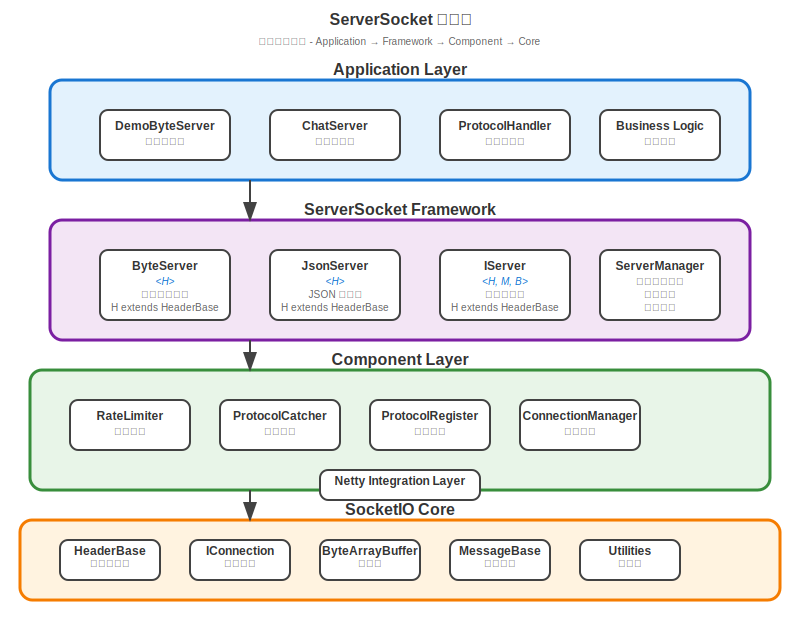

# ServerSocket 服務器端Socket模組

這是 tinysocket 專案的服務器端 Socket 模組，基於 socketio 核心庫實現高性能的 Socket 服務器。

## 📋 模組概述

ServerSocket 模組是 tinysocket 框架的服務器端實現，提供了完整的 Socket 服務器解決方案。它基於 Netty 框架和 socketio 核心庫，為各種網絡應用場景提供高性能、高併發的服務器實現。

## 🏗️ 架構設計

### 核心組件

```
serversocket/
├── socket/              # Socket服務器實現
│   ├── SocketBase.java  # Socket服務器基類（泛型設計）
│   ├── ByteSocket.java  # 二進制數據Socket服務器
│   ├── JsonSocket.java  # JSON格式Socket服務器
│   └── component/       # 組件系統
│       ├── RateLimiter.java     # 智能限流器
│       └── ProtocolCatcher.java # 協議異常捕獲器
└── connection/          # 連接管理實現
    └── (基於 socketio IConnection 接口)
```

### 設計架構圖



## 🚀 核心功能

### 1. SocketBase 泛型基類設計

提供完整的泛型 Socket 服務器基礎架構：

```java
public abstract class SocketBase<H extends HeaderBase, C extends IConnection<B>, 
                                 M extends MessageBase<H, B>, B> implements Runnable
```

- **H**: Header 型別，必須繼承 HeaderBase
- **C**: Connection 型別，必須實現 IConnection 接口
- **M**: Message 型別，必須繼承 MessageBase
- **B**: Buffer 型別，用於數據傳輸（如 ByteArrayBuffer、String 等）

#### 核心特性
- **類型安全**: 編譯期泛型檢查，避免運行時類型錯誤
- **協議註冊**: 基於 ProtocolKey 的協議處理器註冊系統
- **連接管理**: 線程安全的連接生命周期管理
- **性能監控**: 集成 ProfilerUtil 性能分析
- **限流保護**: 內建 RateLimiter 防止服務過載
- **異常處理**: ProtocolCatcher 提供安全的協議處理

### 2. ByteSocket 二進制服務器

高性能的二進制數據 Socket 服務器：

```java
public abstract class ByteSocket<H extends HeaderBase, C extends IConnection<ByteArrayBuffer>>
        extends SocketBase<H, C, ByteMessage<H>, ByteArrayBuffer>
```

#### 核心特性
- **高性能**: 使用 ByteArrayBuffer 進行零拷貝數據傳輸
- **內建 Ping/Pong**: 自動註冊心跳協議，維持連接活性
- **定時任務**: 自動連接檢查和快取管理
- **線程管理**: 獨立的主線程和調度線程池
- **優雅關閉**: 支援服務器的優雅停機

#### 使用示例
```java
public class GameServer extends ByteSocket<GameHeader, GameConnection> {
    
    public GameServer(int port, int maxConnections) {
        super(LoggerFactory.getLogger(GameServer.class), port, maxConnections, 
              GameSocketInitializer.class);
        
        // 註冊遊戲協議
        registerProtocol(1, 1, this::handleLogin);     // 登入
        registerProtocol(1, 2, this::handleLogout);    // 登出  
        registerProtocol(2, 1, this::handleGameAction); // 遊戲操作
    }
    
    @Override
    public String getVersion() {
        return "1.0.0";
    }
    
    @Override
    protected Class<GameConnection> getConnectionClass() {
        return GameConnection.class;
    }
    
    @Override
    public void onConnect(long sessionId) {
        logger.info("遊戲玩家連接: sessionId={}", sessionId);
    }
    
    @Override
    public void onDisconnect(long sessionId) {
        logger.info("遊戲玩家斷開: sessionId={}", sessionId);
        // 清理玩家數據
    }
}
```

### 3. JsonSocket JSON服務器

便於調試和跨語言通信的 JSON 格式服務器：

```java
public abstract class JsonSocket<H extends HeaderBase, C extends IConnection<String>>
        extends SocketBase<H, C, JsonMessage<H>, String>
```

#### 核心特性
- **人類可讀**: JSON 格式便於調試和日誌分析
- **跨語言**: 支援各種程式語言客戶端
- **內建 Ping/Pong**: JSON 格式的心跳機制
- **類型安全**: 基於泛型的 JSON 消息處理

#### 使用示例
```java
public class WebApiServer extends JsonSocket<ApiHeader, ApiConnection> {
    
    public WebApiServer(int port, int maxConnections) {
        super(LoggerFactory.getLogger(WebApiServer.class), port, maxConnections,
              ApiSocketInitializer.class);
        
        // 註冊 API 協議
        registerProtocol(1, 1, this::handleUserInfo);
        registerProtocol(1, 2, this::handleOrderList);
        registerProtocol(2, 1, this::handleNotification);
    }
    
    private void handleUserInfo(JsonMessage<ApiHeader> message) {
        String jsonData = message.getBuffer();
        // 處理 JSON 格式的用戶資料請求
        JsonObject request = JsonUtil.parseObject(jsonData);
        
        // 回應 JSON 數據
        JsonObject response = new JsonObject();
        response.put("status", "success");
        response.put("data", userData);
        
        send(message.getHeader().getSessionId(), 1, 1, 
             message.getHeader().getRequestId(), response.toString());
    }
}
```

### 4. 組件系統

#### RateLimiter 智能限流器

提供動態限流功能，防止服務器過載：

```java
// 基本使用
RateLimiter rateLimiter = new RateLimiter();

// 啟用限流：10分鐘內，20%的請求通過
rateLimiter.enable(10 * 60 * 1000L, 20);

// 檢查請求是否通過
if (rateLimiter.pass()) {
    // 處理正常請求
} else {
    // 限流中，回應忙碌訊息
}

// 動態調整限流參數
rateLimiter.enable(5 * 60 * 1000L, 50); // 5分鐘，50%通過率

// 關閉限流
rateLimiter.disable();
```

#### 特性
- **自動過期**: 限流時間到期自動恢復正常
- **動態調整**: 運行時可調整限流參數
- **線程安全**: 支援高併發場景使用
- **隨機算法**: 基於隨機數實現平滑限流

#### ProtocolCatcher 協議捕獲器

提供類型安全的協議異常處理：

```java
@FunctionalInterface
public interface ProtocolCatcher<T, E extends Exception> {
    void accept(T t) throws E;
}

// 在 SocketBase 中使用
protected Consumer<M> catchException(ProtocolCatcher<M, Exception> event) {
    return message -> {
        try {
            // 檢查消息延遲
            long delay = System.currentTimeMillis() - message.getHeader().getRcvTimestamp();
            if (delay > WARN_THRESHOLD) {
                logger.warn("協議處理延遲: {}ms", delay);
            }
            
            if (delay > ABANDON_THRESHOLD) {
                // 延遲過長，放棄處理並回應忙碌
                sendBusyResponse(message);
                return;
            }
            
            // 執行實際的協議處理
            event.accept(message);
            
        } catch (Exception e) {
            logger.error("協議處理異常: {}", e.getMessage(), e);
        }
    };
}
```

## 💡 完整使用示例

### 遊戲服務器示例

```java
// 1. 定義自定義Header
public class GameHeader extends HeaderBase {
    private String clientVersion;
    private int deviceType;
    
    // getter/setter...
}

// 2. 定義自定義Connection
public class GameConnection implements IConnection<ByteArrayBuffer> {
    private String playerId;
    private String playerName;
    private long lastActiveTime;
    private Channel channel;
    private String version;
    private long sessionId;
    private long connectTime;
    
    @Override
    public void send(int mainNo, int subNo, ByteArrayBuffer buffer) {
        send(mainNo, subNo, 0L, buffer);
    }
    
    @Override
    public void send(int mainNo, int subNo, long requestId, ByteArrayBuffer buffer) {
        // 實現發送邏輯
        GameHeader header = new GameHeader();
        header.setMainNo(mainNo);
        header.setSubNo(subNo);
        header.setSessionId(sessionId);
        header.setRequestId(requestId);
        
        ByteMessage<GameHeader> message = new ByteMessage<>(header, buffer);
        // 通過 channel 發送 message
    }
    
    @Override
    public void sendServerBusyMessage(int mainNo, int subNo, long requestId) {
        ByteArrayBuffer busyBuffer = new ByteArrayBuffer();
        busyBuffer.writeInt(-1); // 錯誤碼
        busyBuffer.writeString("服務器忙碌，請稍後重試");
        send(mainNo, subNo, requestId, busyBuffer);
    }
    
    // 實現其他 IConnection 方法...
}

// 3. 實現遊戲服務器
public class GameServer extends ByteSocket<GameHeader, GameConnection> {
    
    public GameServer(int port, int maxConnections) {
        super(LoggerFactory.getLogger(GameServer.class), port, maxConnections,
              GameSocketInitializer.class);
        
        // 註冊遊戲協議
        registerProtocol(1, 1, catchException(this::handleLogin));
        registerProtocol(1, 2, catchException(this::handleLogout));
        registerProtocol(2, 1, catchException(this::handlePlayerMove));
        registerProtocol(2, 2, catchException(this::handlePlayerChat));
        registerProtocol(3, 1, catchException(this::handleRoomJoin));
        registerProtocol(3, 2, catchException(this::handleRoomLeave));
    }
    
    @Override
    public String getVersion() {
        return "1.0.0";
    }
    
    @Override
    protected Class<GameConnection> getConnectionClass() {
        return GameConnection.class;
    }
    
    @Override
    public void onConnect(long sessionId) {
        logger.info("玩家連接: sessionId={}", sessionId);
        
        // 更新統計
        int currentConnections = getNowConnect();
        int maxConnections = getMaxConnect();
        logger.info("當前連接數: {}/{}", currentConnections, getLimitConnect());
        
        if (currentConnections > maxConnections * 0.8) {
            logger.warn("連接數接近上限，當前: {}", currentConnections);
        }
    }
    
    @Override
    public void onDisconnect(long sessionId) {
        logger.info("玩家斷開: sessionId={}", sessionId);
        
        // 清理玩家數據
        GameConnection connection = getConnection(sessionId);
        if (connection != null && connection.getPlayerId() != null) {
            // 通知其他玩家該玩家離線
            notifyPlayerOffline(connection.getPlayerId());
            
            // 從遊戲房間移除玩家
            removeFromGameRoom(connection.getPlayerId());
        }
    }
    
    private void handleLogin(ByteMessage<GameHeader> message) {
        GameHeader header = message.getHeader();
        ByteArrayBuffer buffer = message.getBuffer();
        
        // 讀取登入數據
        String username = buffer.readString();
        String password = buffer.readString();
        String deviceId = buffer.readString();
        
        // 驗證用戶登入
        LoginResult result = authenticateUser(username, password, deviceId);
        
        // 準備回應
        ByteArrayBuffer response = new ByteArrayBuffer();
        response.writeInt(result.getCode());
        response.writeString(result.getMessage());
        
        if (result.isSuccess()) {
            // 登入成功，設置連接信息
            GameConnection connection = getConnection(header.getSessionId());
            if (connection != null) {
                connection.setPlayerId(result.getPlayerId());
                connection.setPlayerName(result.getPlayerName());
                connection.setLastActiveTime(System.currentTimeMillis());
            }
            
            // 返回玩家資料
            response.writeString(result.getPlayerId());
            response.writeString(result.getPlayerName());
            response.writeInt(result.getLevel());
            response.writeLong(result.getExp());
        }
        
        send(header.getSessionId(), 1, 1, header.getRequestId(), response);
    }
    
    private void handlePlayerMove(ByteMessage<GameHeader> message) {
        GameHeader header = message.getHeader();
        ByteArrayBuffer buffer = message.getBuffer();
        
        // 讀取移動數據
        float x = buffer.readFloat();
        float y = buffer.readFloat();
        float z = buffer.readFloat();
        float rotation = buffer.readFloat();
        
        // 更新玩家位置
        GameConnection connection = getConnection(header.getSessionId());
        if (connection != null) {
            updatePlayerPosition(connection.getPlayerId(), x, y, z, rotation);
            
            // 廣播移動訊息給同房間其他玩家
            broadcastToRoom(connection.getPlayerId(), 2, 1, buffer);
        }
    }
    
    private void handlePlayerChat(ByteMessage<GameHeader> message) {
        GameHeader header = message.getHeader();
        ByteArrayBuffer buffer = message.getBuffer();
        
        String chatMessage = buffer.readString();
        int chatType = buffer.readInt(); // 1: 世界, 2: 房間, 3: 私聊
        
        GameConnection connection = getConnection(header.getSessionId());
        if (connection != null) {
            // 構建聊天廣播消息
            ByteArrayBuffer broadcast = new ByteArrayBuffer();
            broadcast.writeString(connection.getPlayerName());
            broadcast.writeString(chatMessage);
            broadcast.writeInt(chatType);
            broadcast.writeLong(System.currentTimeMillis());
            
            // 根據聊天類型進行廣播
            switch (chatType) {
                case 1: // 世界聊天
                    broadcast(2, 2, broadcast);
                    break;
                case 2: // 房間聊天
                    broadcastToRoom(connection.getPlayerId(), 2, 2, broadcast);
                    break;
                case 3: // 私聊
                    String targetPlayer = buffer.readString();
                    sendToPlayer(targetPlayer, 2, 2, broadcast);
                    break;
            }
        }
    }
    
    // 輔助方法
    private LoginResult authenticateUser(String username, String password, String deviceId) {
        // 實現用戶認證邏輯
        return new LoginResult();
    }
    
    private void updatePlayerPosition(String playerId, float x, float y, float z, float rotation) {
        // 更新玩家位置到數據庫或緩存
    }
    
    private void broadcastToRoom(String playerId, int mainNo, int subNo, ByteArrayBuffer buffer) {
        // 廣播消息給同房間玩家
    }
    
    private void sendToPlayer(String targetPlayerId, int mainNo, int subNo, ByteArrayBuffer buffer) {
        // 發送消息給指定玩家
    }
}

// 4. Spring Boot 配置
@Configuration
public class GameServerConfig {
    
    @Bean
    public GameServer gameServer() {
        return new GameServer(8080, 1000);
    }
    
    @EventListener(ApplicationReadyEvent.class)
    public void startGameServer(ApplicationReadyEvent event) {
        GameServer server = event.getApplicationContext().getBean(GameServer.class);
        server.bind();
        
        logger.info("遊戲服務器已啟動，端口: {}", server.getPort());
    }
    
    @PreDestroy
    public void stopGameServer() {
        GameServer server = applicationContext.getBean(GameServer.class);
        server.close();
        
        logger.info("遊戲服務器已關閉");
    }
}

// 5. 應用程式入口
@SpringBootApplication
public class GameServerApplication {
    
    public static void main(String[] args) {
        SpringApplication.run(GameServerApplication.class, args);
    }
}
```

### Web API 服務器示例

```java
public class WebApiServer extends JsonSocket<ApiHeader, ApiConnection> {
    
    public WebApiServer(int port, int maxConnections) {
        super(LoggerFactory.getLogger(WebApiServer.class), port, maxConnections,
              ApiSocketInitializer.class);
        
        // 註冊 API 協議
        registerProtocol(1, 1, catchException(this::handleUserInfo));
        registerProtocol(1, 2, catchException(this::handleUserList));
        registerProtocol(2, 1, catchException(this::handleOrderCreate));
        registerProtocol(2, 2, catchException(this::handleOrderQuery));
        registerProtocol(3, 1, catchException(this::handleRealTimeData));
    }
    
    private void handleUserInfo(JsonMessage<ApiHeader> message) {
        String jsonRequest = message.getBuffer();
        JSONObject request = JsonUtil.parseObject(jsonRequest);
        
        String userId = request.getString("userId");
        
        // 查詢用戶信息
        User user = userService.getUserById(userId);
        
        // 構建 JSON 響應
        JSONObject response = new JSONObject();
        if (user != null) {
            response.put("code", 0);
            response.put("message", "success");
            response.put("data", JsonUtil.toJson(user));
        } else {
            response.put("code", -1);
            response.put("message", "用戶不存在");
        }
        
        send(message.getHeader().getSessionId(), 1, 1, 
             message.getHeader().getRequestId(), response.toString());
    }
    
    private void handleRealTimeData(JsonMessage<ApiHeader> message) {
        // 處理實時數據推送訂閱
        String jsonRequest = message.getBuffer();
        JSONObject request = JsonUtil.parseObject(jsonRequest);
        
        String dataType = request.getString("dataType");
        String subscriptionId = request.getString("subscriptionId");
        
        // 訂閱實時數據
        subscribeRealTimeData(message.getHeader().getSessionId(), dataType, subscriptionId);
        
        JSONObject response = new JSONObject();
        response.put("code", 0);
        response.put("message", "訂閱成功");
        response.put("subscriptionId", subscriptionId);
        
        send(message.getHeader().getSessionId(), 3, 1, 
             message.getHeader().getRequestId(), response.toString());
    }
}
```

## 🧪 測試

### 單元測試

```java
@SpringBootTest
class MyGameServerTest {
    
    @Autowired
    private MyGameServer gameServer;
    
    @Test
    void testServerStartup() {
        // 測試服務器啟動
        assertDoesNotThrow(() -> {
            gameServer.bind();
            assertTrue(gameServer.isBinding());
        });
    }
    
    @Test
    void testConnectionLimit() {
        // 測試連接數限制
        assertEquals(1000, gameServer.getMaxConnect());
        
        // 模擬大量連接
        for (int i = 0; i < 1500; i++) {
            // 前1000個應該成功，後500個應該被拒絕
            // 實際測試需要模擬客戶端連接
        }
    }
    
    @Test
    void testRateLimiter() {
        // 測試限流功能
        gameServer.enableRateLimiter(60000, 50); // 1分鐘內50%通過率
        
        // 模擬大量請求，驗證限流效果
        int passCount = 0;
        for (int i = 0; i < 100; i++) {
            if (gameServer.checkRateLimit("test-client-" + i)) {
                passCount++;
            }
        }
        
        // 通過率應該接近50%
        assertTrue(passCount >= 40 && passCount <= 60);
    }
    
    @Test
    void testMessageProtocol() {
        // 測試訊息協議
        GameConnection mockConnection = mock(GameConnection.class);
        
        // 測試登入協議
        ByteArrayBuffer loginData = new ByteArrayBuffer();
        loginData.writeInt(1001);  // LOGIN
        loginData.writeString("testUser");
        loginData.writeString("testPassword");
        
        assertDoesNotThrow(() -> {
            gameServer.receiveByte(mockConnection, loginData);
        });
    }
    
    @AfterEach
    void cleanup() {
        if (gameServer.isBinding()) {
            gameServer.close();
        }
    }
}

// 集成測試
@SpringBootTest(webEnvironment = SpringBootTest.WebEnvironment.RANDOM_PORT)
class ServerSocketIntegrationTest {
    
    @LocalServerPort
    private int webPort;
    
    @Value("${tinysocket.server.port}")
    private int socketPort;
    
    @Test
    void testHealthEndpoint() {
        RestTemplate restTemplate = new RestTemplate();
        String url = "http://localhost:" + webPort + "/actuator/tinysocket/health";
        
        ResponseEntity<Map> response = restTemplate.getForEntity(url, Map.class);
        assertEquals(HttpStatus.OK, response.getStatusCode());
        
        Map<String, Object> health = response.getBody();
        assertEquals("UP", health.get("status"));
        assertEquals(socketPort, health.get("port"));
    }
    
    @Test
    void testClientConnection() throws Exception {
        // 使用 Netty 客戶端測試實際連接
        EventLoopGroup group = new NioEventLoopGroup();
        try {
            Bootstrap bootstrap = new Bootstrap();
            bootstrap.group(group)
                .channel(NioSocketChannel.class)
                .handler(new ChannelInitializer<SocketChannel>() {
                    @Override
                    protected void initChannel(SocketChannel ch) {
                        ch.pipeline().addLast(new TestClientHandler());
                    }
                });
            
            ChannelFuture future = bootstrap.connect("localhost", socketPort).sync();
            assertTrue(future.isSuccess());
            
            // 發送測試訊息
            Channel channel = future.channel();
            ByteArrayBuffer testMessage = new ByteArrayBuffer();
            testMessage.writeInt(1001); // LOGIN
            testMessage.writeString("testUser");
            
            channel.writeAndFlush(Unpooled.wrappedBuffer(testMessage.toBytes()));
            
            // 等待響應
            Thread.sleep(1000);
            
            channel.close().sync();
        } finally {
            group.shutdownGracefully();
        }
    }
}

// 測試客戶端處理器
class TestClientHandler extends ChannelInboundHandlerAdapter {
    
    @Override
    public void channelRead(ChannelHandlerContext ctx, Object msg) {
        ByteBuf buf = (ByteBuf) msg;
        byte[] data = new byte[buf.readableBytes()];
        buf.readBytes(data);
        
        ByteArrayBuffer response = new ByteArrayBuffer(data);
        int protocolId = response.readInt();
        
        // 驗證響應協議
        if (protocolId == 1001) { // LOGIN_RESPONSE
            String result = response.readString();
            System.out.println("登入響應: " + result);
        }
        
        buf.release();
    }
    
    @Override
    public void exceptionCaught(ChannelHandlerContext ctx, Throwable cause) {
        cause.printStackTrace();
        ctx.close();
    }
}
```

### 性能測試

```java
@Component
public class PerformanceTest {
    
    @Autowired
    private MyGameServer gameServer;
    
    public void performanceTest() {
        int clientCount = 1000;
        int messageCount = 100;
        
        ExecutorService executor = Executors.newFixedThreadPool(50);
        CountDownLatch latch = new CountDownLatch(clientCount);
        AtomicLong totalTime = new AtomicLong();
        AtomicInteger successCount = new AtomicInteger();
        
        for (int i = 0; i < clientCount; i++) {
            final int clientId = i;
            executor.submit(() -> {
                try {
                    long startTime = System.currentTimeMillis();
                    
                    // 建立連接
                    Socket socket = new Socket("localhost", gameServer.getPort());
                    DataOutputStream out = new DataOutputStream(socket.getOutputStream());
                    DataInputStream in = new DataInputStream(socket.getInputStream());
                    
                    // 發送訊息
                    for (int j = 0; j < messageCount; j++) {
                        ByteArrayBuffer message = new ByteArrayBuffer();
                        message.writeInt(2001); // CHAT
                        message.writeString("Client-" + clientId);
                        message.writeString("測試訊息 " + j);
                        
                        byte[] data = message.toBytes();
                        out.writeInt(data.length);
                        out.write(data);
                        
                        // 讀取響應
                        int responseLength = in.readInt();
                        byte[] responseData = new byte[responseLength];
                        in.readFully(responseData);
                    }
                    
                    socket.close();
                    
                    long endTime = System.currentTimeMillis();
                    totalTime.addAndGet(endTime - startTime);
                    successCount.incrementAndGet();
                    
                } catch (Exception e) {
                    System.err.println("客戶端 " + clientId + " 測試失敗: " + e.getMessage());
                } finally {
                    latch.countDown();
                }
            });
        }
        
        try {
            latch.await(60, TimeUnit.SECONDS);
            
            double avgTime = totalTime.get() / (double) successCount.get();
            double successRate = successCount.get() / (double) clientCount * 100;
            
            System.out.println("=== 性能測試結果 ===");
            System.out.println("總客戶端數: " + clientCount);
            System.out.println("成功客戶端數: " + successCount.get());
            System.out.println("成功率: " + String.format("%.2f%%", successRate));
            System.out.println("平均響應時間: " + String.format("%.2f ms", avgTime));
            System.out.println("總訊息數: " + (clientCount * messageCount));
            System.out.println("成功訊息數: " + (successCount.get() * messageCount));
            
        } catch (InterruptedException e) {
            System.err.println("性能測試超時");
        } finally {
            executor.shutdown();
        }
    }
}
```

## 🚀 生產部署

### 部署檢查清單

- [ ] **環境準備**
  - [ ] Java 21+ 運行環境
  - [ ] 足夠的內存（建議 4GB+）
  - [ ] 網絡端口開放（Socket 端口 + 管理端口）
  - [ ] 日誌目錄權限配置

- [ ] **配置檢查**
  - [ ] 生產環境配置文件
  - [ ] 數據庫連接配置
  - [ ] 日誌級別設置
  - [ ] 性能參數調優

- [ ] **安全配置**
  - [ ] 防火牆規則
  - [ ] SSL/TLS 配置（如需要）
  - [ ] 認證機制啟用
  - [ ] 敏感信息加密

- [ ] **監控配置**
  - [ ] 健康檢查端點
  - [ ] 監控指標收集
  - [ ] 告警規則設置
  - [ ] 日誌聚合配置

### 生產環境配置示例

```yaml
# application-prod.yml
spring:
  profiles:
    active: prod
  
tinysocket:
  server:
    port: 8080
    max-connections: 5000
    boss-threads: 2
    worker-threads: 16
    
    # 生產環境優化配置
    so-backlog: 2048
    so-keepalive: true
    tcp-nodelay: true
    so-reuseaddr: true
    
    # 超時配置
    connection-timeout: 30000
    read-timeout: 120000
    write-timeout: 30000
    
    # 限流配置（生產環境建議啟用）
    rate-limiter:
      enabled: true
      default-limit-time: 300000    # 5分鐘
      default-filter-rate: 30       # 30%通過率
    
    # 性能監控
    profiler:
      enabled: true
      warn-threshold: 500           # 更嚴格的警告閾值
      abandon-threshold: 2000       # 更嚴格的放棄閾值

# 管理端口配置
management:
  server:
    port: 8081
  endpoints:
    web:
      exposure:
        include: health,info,metrics,prometheus
  endpoint:
    health:
      show-details: when-authorized

# 日誌配置
logging:
  level:
    root: INFO
    com.vscodelife: INFO
    io.netty: WARN
  pattern:
    file: "%d{yyyy-MM-dd HH:mm:ss.SSS} [%thread] %-5level %logger{36} - %msg%n"
  file:
    name: /app/logs/tinysocket.log
  logback:
    rollingpolicy:
      max-file-size: 100MB
      max-history: 30
      total-size-cap: 3GB
```

### JVM 調優參數

```bash
# 啟動腳本示例
#!/bin/bash

# JVM 基本配置
JAVA_OPTS="-Xms2g -Xmx4g"

# GC 配置
JAVA_OPTS="$JAVA_OPTS -XX:+UseG1GC"
JAVA_OPTS="$JAVA_OPTS -XX:MaxGCPauseMillis=200"
JAVA_OPTS="$JAVA_OPTS -XX:G1HeapRegionSize=16m"

# JIT 編譯優化
JAVA_OPTS="$JAVA_OPTS -XX:+UseStringDeduplication"
JAVA_OPTS="$JAVA_OPTS -XX:+OptimizeStringConcat"

# 監控和調試
JAVA_OPTS="$JAVA_OPTS -XX:+HeapDumpOnOutOfMemoryError"
JAVA_OPTS="$JAVA_OPTS -XX:HeapDumpPath=/app/logs/heapdump"
JAVA_OPTS="$JAVA_OPTS -XX:+PrintGCDetails"
JAVA_OPTS="$JAVA_OPTS -XX:+PrintGCTimeStamps"
JAVA_OPTS="$JAVA_OPTS -Xloggc:/app/logs/gc.log"

# 網絡優化
JAVA_OPTS="$JAVA_OPTS -Djava.net.preferIPv4Stack=true"
JAVA_OPTS="$JAVA_OPTS -Dio.netty.leakDetection.level=simple"

# 啟動應用
java $JAVA_OPTS -jar game-server.jar
```

### Kubernetes 部署

```yaml
# k8s-deployment.yaml
apiVersion: apps/v1
kind: Deployment
metadata:
  name: tinysocket-game-server
  labels:
    app: tinysocket-game-server
spec:
  replicas: 3
  selector:
    matchLabels:
      app: tinysocket-game-server
  template:
    metadata:
      labels:
        app: tinysocket-game-server
    spec:
      containers:
      - name: game-server
        image: tinysocket/game-server:latest
        ports:
        - containerPort: 8080
          name: socket-port
        - containerPort: 8081
          name: management
        env:
        - name: SPRING_PROFILES_ACTIVE
          value: "kubernetes"
        - name: JAVA_OPTS
          value: "-Xms1g -Xmx2g -XX:+UseG1GC"
        resources:
          requests:
            memory: "1Gi"
            cpu: "500m"
          limits:
            memory: "3Gi"
            cpu: "2000m"
        livenessProbe:
          httpGet:
            path: /actuator/health
            port: 8081
          initialDelaySeconds: 60
          periodSeconds: 30
        readinessProbe:
          httpGet:
            path: /actuator/health/readiness
            port: 8081
          initialDelaySeconds: 30
          periodSeconds: 10
        volumeMounts:
        - name: logs
          mountPath: /app/logs
      volumes:
      - name: logs
        emptyDir: {}

---
apiVersion: v1
kind: Service
metadata:
  name: tinysocket-service
spec:
  selector:
    app: tinysocket-game-server
  ports:
  - name: socket
    protocol: TCP
    port: 8080
    targetPort: 8080
  - name: management
    protocol: TCP
    port: 8081
    targetPort: 8081
  type: LoadBalancer

---
apiVersion: v1
kind: ConfigMap
metadata:
  name: tinysocket-config
data:
  application-kubernetes.yml: |
    tinysocket:
      server:
        port: 8080
        max-connections: 3000
    management:
      endpoints:
        web:
          exposure:
            include: health,metrics,prometheus
```

### 問題排查指南

#### 常見問題及解決方案

**1. 連接超時問題**
```bash
# 檢查網絡連通性
telnet <server-ip> 8080

# 檢查端口佔用
netstat -tlnp | grep 8080

# 檢查防火牆設置
sudo ufw status
```

**2. 內存洩漏問題**
```bash
# 生成堆轉儲
jcmd <pid> GC.run_finalization
jcmd <pid> VM.gc
jmap -dump:format=b,file=heapdump.hprof <pid>

# 分析內存使用
jstat -gc <pid> 5s
```

**3. 性能問題分析**
```bash
# CPU 分析
top -H -p <pid>
jstack <pid> > thread-dump.txt

# I/O 分析
iotop -p <pid>
lsof -p <pid>
```

**4. 網絡問題診斷**
```bash
# 查看連接狀態
ss -antpl | grep 8080

# 查看網絡統計
netstat -s | grep -i error

# 抓包分析
tcpdump -i any -w capture.pcap port 8080
```

#### 日誌分析

```bash
# 查看錯誤日誌
grep -i error /app/logs/tinysocket.log | tail -100

# 查看連接統計
grep "連接" /app/logs/tinysocket.log | tail -50

# 查看性能警告
grep "warn\|slow" /app/logs/tinysocket.log | tail -50

# 實時監控日誌
tail -f /app/logs/tinysocket.log | grep -E "(ERROR|WARN|連接)"
```

## 📋 開發計劃

### 已完成功能 ✅

- [x] **核心Socket框架**
  - [x] SocketBase 泛型架構設計
  - [x] ByteSocket 二進制協議支持
  - [x] JsonSocket 文本協議支持
  - [x] 連接池管理和限制

- [x] **組件系統**
  - [x] RateLimiter 智能限流組件
  - [x] ProtocolCatcher 異常處理組件
  - [x] ProfilerUtil 性能監控組件
  - [x] 定時任務調度系統

- [x] **Spring Boot 整合**
  - [x] 自動配置支持
  - [x] 健康檢查端點
  - [x] 監控指標收集
  - [x] 優雅啟動和關閉

### 進行中功能 🔄

- [ ] **集群支持**
  - [ ] Redis 分佈式會話管理
  - [ ] 負載均衡策略
  - [ ] 節點發現和故障轉移
  - [ ] 集群內訊息路由

- [ ] **安全增強**
  - [ ] SSL/TLS 加密傳輸
  - [ ] 客戶端認證機制
  - [ ] 訊息簽名和驗證
  - [ ] 防護攻擊檢測

### 計劃功能 📅

- [ ] **高級功能**
  - [ ] 訊息持久化機制
  - [ ] 離線訊息推送
  - [ ] 房間/頻道管理
  - [ ] 廣播和組播支持

- [ ] **運維增強**
  - [ ] 動態配置更新
  - [ ] 熱部署支持
  - [ ] 監控面板
  - [ ] 性能調優建議

- [ ] **客戶端SDK**
  - [ ] Java 客戶端SDK
  - [ ] JavaScript 客戶端SDK
  - [ ] Unity 客戶端SDK
  - [ ] 跨平台支持

### 長期願景 🎯

- **高性能**: 單機支持 100K+ 並發連接
- **高可用**: 99.99% 可用性保證
- **易擴展**: 支持水平擴展到多機集群
- **易使用**: 提供完整的開發者工具鏈

## 🤝 貢獻指南

歡迎提交 Issue 和 Pull Request 來幫助改進 TinySocket！

### 開發環境設置

```bash
# 克隆專案
git clone https://github.com/vscodelife/tinysocket.git
cd tinysocket

# 編譯專案
mvn clean compile

# 運行測試
mvn test

# 打包
mvn clean package
```

### 提交規範

請遵循以下提交訊息格式：
```
<類型>(<範圍>): <描述>

<詳細說明>

<相關Issue>
```

類型包括：
- `feat`: 新功能
- `fix`: 修復bug
- `docs`: 文檔更新
- `style`: 代碼格式化
- `refactor`: 重構
- `test`: 測試相關
- `chore`: 建構過程或工具變動

## 📄 許可證

本專案采用 [MIT 許可證](../LICENSE)。

## 📞 聯繫方式

- **專案主頁**: https://github.com/vscodelife/tinysocket
- **問題反饋**: https://github.com/vscodelife/tinysocket/issues
- **討論社區**: https://github.com/vscodelife/tinysocket/discussions

---

*TinySocket ServerSocket - 讓Socket服務器開發變得簡單而強大！*
